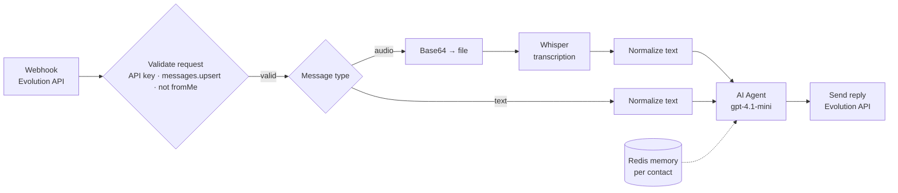

# 🤖 AI WhatsApp Agent with n8n

A ready-to-import **n8n workflow** for a WhatsApp customer-service agent. It runs on [Evolution API](https://github.com/EvolutionAPI/evolution-api) + OpenAI, understands **text and voice messages**, and keeps a **separate conversation memory per contact** in Redis.

This repo also includes a step-by-step guide to self-host the whole stack on a single VPS.

## How it works

| Step | Node | What it does |
| --- | --- | --- |
| 1 | `Webhook` | Receives every event from Evolution API |
| 2 | `Validar requisição` | Accepts only requests with your instance API key, `messages.upsert` events, and messages **not sent by the bot itself** (prevents reply loops) |
| 3 | `Tipo de mensagem` | Routes `audioMessage` and `conversation` |
| 4 | `Transcrever áudio (Whisper)` | Converts the base64 voice note to a file and transcribes it |
| 5 | `Texto do áudio` / `Texto da mensagem` | Normalizes both paths into the same fields: `texto`, `numero`, `instancia` |
| 6 | `Agente de atendimento` | LangChain agent with a system prompt and Redis memory keyed by the sender's number |
| 7 | `Enviar resposta` | Replies to the same contact, on the same instance that received the message |

The bundled system prompt is a **fictional real-estate agency** ("VivaBem Imóveis"). Replace it with your own business rules, catalog and tone.

## Stack

- **n8n** for orchestration (`@n8n/n8n-nodes-langchain` agent)
- **Evolution API** as the WhatsApp gateway
- **OpenAI**: `gpt-4.1-mini` for replies and Whisper for transcription
- **Redis** for chat memory and **PostgreSQL** for n8n and Evolution data
- **EasyPanel** on any VPS (Docker under the hood)

## 1. Server setup

1. Create a VPS (1 vCPU / 2 GB RAM is enough to start) with Ubuntu 22.04+ and install [EasyPanel](https://easypanel.io/docs).
2. In EasyPanel, add these services:
   - **PostgreSQL**, named `n8n-postgres`
   - **Redis**, named `n8n-redis`
   - **n8n**, pointing to the Postgres service
   - **Evolution API**, as a Docker app using `ghcr.io/evolutionapi/evolution-api:<latest-release>`, with env vars from the project's `.env.example`, the Postgres/Redis connection strings, a strong `AUTHENTICATION_API_KEY`, and port `8080` exposed
3. Open `https://<evolution-domain>/manager`, create an instance, and pair your WhatsApp with the QR code.

## 2. Evolution API instance

In the instance settings:

- **Webhook URL:** the production URL of the n8n `Webhook` node
- **Events:** `MESSAGES_UPSERT`
- **Webhook base64:** **on** (required for voice notes)

## 3. Import the workflow

1. In n8n, go to **Settings → Community nodes** and install `n8n-nodes-evolution-api`.
2. Create a new workflow and use **Import from file** with [`workflow.json`](./workflow.json).
3. Create credentials and select them in the nodes: **OpenAI**, **Redis** and **Evolution API**.
4. In `Validar requisição`, replace `COLE_AQUI_A_API_KEY_DA_SUA_INSTANCIA` with your **instance** API key. Evolution sends it in every webhook as `body.apikey`.
5. Edit the agent's system prompt and activate the workflow.

## 4. Test

- Send a text and a voice note to the paired number from **another** phone.
- Follow each run in **n8n → Executions**.

## Security notes

- Never commit real API keys, webhook paths or phone numbers. n8n exports credentials only as IDs, but **values typed into node fields are exported in plain text**.
- Keep the webhook validation node. Without it, anyone who finds the URL can make your bot send messages and spend your OpenAI credits.

## Roadmap

- [ ] Scheduling flow (calendar integration)
- [ ] Human handoff when the customer asks for an agent
- [ ] Knowledge base (RAG) instead of a catalog inside the prompt

## License

[MIT](./LICENSE)
